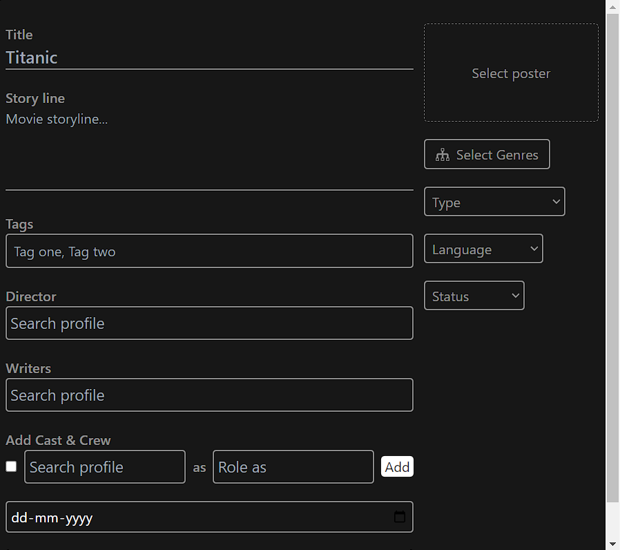

# Admin (controller of the app)

The Admin, entrusted with the task of adding movies, is the guardian of quality, ensuring that every addition to the realm of entertainment meets high standards.

<mark style="color:orange;">**let's explore first add Actors**</mark>\
The Admin is like a keeper of magical pictures. They want movie posters to be like special paintings in JPEG format, making them look really nice. Before a movie joins our collection, the Admin makes sure to have a list of actors and creators, just like characters in a story. It's like making sure everything is perfect before the movie becomes a part of our magical world!

<figure><figcaption>
<mark style="color:orange;"><strong>Getting Actors</strong></mark> 
</figcaption></figure>

Please take a five-second pause to envision an image. In this scenario, we require an **image storage solution**. Who will manage the storage of these images? The user needs to input a name and description. When the "create" button is clicked, the data will be sent to the server-side for processing.

<mark style="color:orange;">**Upload movie**</mark>\
\
The Admin, entrusted with the task of adding movies, is the guardian of quality, ensuring that every addition to the realm of entertainment meets high standards. Here's a refined description of their responsibilities:

The diligent Admin bears the responsibility of curating the movie collection with utmost care. They meticulously assess the quality of each movie poster and trailer, upholding a standard that befits the enchanted screen. A rulebook guides their discerning eye, decreeing that video <mark style="color:red;">**sizes exceeding 20MB**</mark> are not to be admitted into this realm of cinematic wonder.\
To maintain the enchantment, the Admin strictly mandates that videos must gracefully dance in the formats of <mark style="color:red;">MP4 or AVI.</mark>

<figure><figcaption>
<mark style="color:orange;"><strong>Upload Trailer</strong></mark>
</figcaption></figure>

In the realm of images, the Admin insists upon posters draped in the regality of the <mark style="color:red;">JPEG format</mark>, ensuring a visual feast for the beholder. The cast and crew details, akin to the threads of a captivating story, must be meticulously woven before the movie finds its place in the kingdom.

<figure><figcaption>
<mark style="color:orange;"><strong>filling out Movies</strong></mark> 
</figcaption></figure>

The Admin has a job to make sure all the important information is given in a form before we can add a movie. First, the Admin fills in details like the movie's name, actors, and other important things. Once all that is done, a special bar that shows the progress becomes invisible, signaling that everything is ready. After that, the Admin can finally submit the form, and the movie becomes a part of our collection!

<mark style="color:orange;">**The burning question of who gets to be the admin is a real knee-slapper! Drumroll,**</mark>** please... the answer is simple**: <mark style="color:purple;">**the Developer, aka the Grand Admin Overlord, holds the power to pick who joins the admin party**</mark>**!** 🎉👑


[developer](../developer/)

