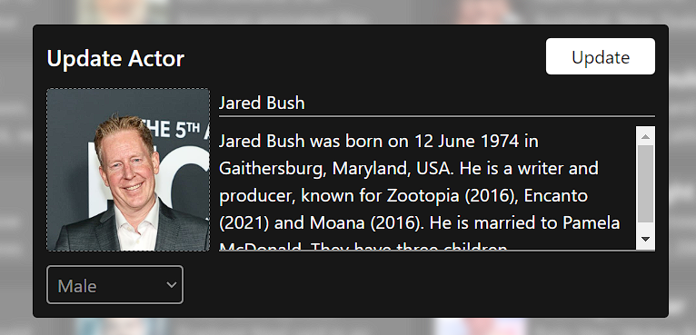

# Actor

<figure><figcaption><p><mark style="color:orange;"><strong>Admin view of Actors</strong></mark></p></figcaption></figure>

the code behind this page is .......

```jsx
import React, { useEffect, useState } from "react";
import { BsPencilSquare, BsTrash } from "react-icons/bs";
import { deleteActor, getActors, searchActor } from "../../api/actor";
import { useNotification, useSearch } from "../../hooks";
import AppSearchForm from "../form/AppSearchForm";
import ConfirmModal from "../models/ConfirmModal";
import UpdateActor from "../models/UpdateActor";
import NextAndPrevButton from "../NextAndPrevButton";
import NotFoundText from "../NotFoundText";

let currentPageNo = 0;
const limit = 20;

export default function Actors() {
  const [actors, setActors] = useState([]);
  const [results, setResults] = useState([]);
  const [reachedToEnd, setReachedToEnd] = useState(false);
  const [busy, setBusy] = useState(false);
  const [showUpdateModal, setShowUpdateModal] = useState(false);
  const [showConfirmModal, setShowConfirmModal] = useState(false);
  const [selectedProfile, setSelectedProfile] = useState(null);
  const { updateNotification } = useNotification();
  const { handleSearch, resetSearch, resultNotFound } = useSearch();

  const fetchActors = async (pageNo) => {
    const { profiles, error } = await getActors(pageNo, limit);
    if (error) return updateNotification("error", error);

    if (!profiles.length) {
      currentPageNo = pageNo - 1;
      return setReachedToEnd(true);
    }

    setActors([...profiles]);
  };

  const handleOnNextClick = () => {
    if (reachedToEnd) return;
    currentPageNo += 1;
    fetchActors(currentPageNo);
  };

  const handleOnPrevClick = () => {
    if (currentPageNo <= 0) return;
    if (reachedToEnd) setReachedToEnd(false);

    currentPageNo -= 1;
    fetchActors(currentPageNo);
  };

  const handleOnEditClick = (profile) => {
    setShowUpdateModal(true);
    setSelectedProfile(profile);
  };

  const hideUpdateModal = () => {
    setShowUpdateModal(false);
  };

  const handleOnSearchSubmit = (value) => {
    handleSearch(searchActor, value, setResults);
  };

  const handleSearchFormReset = () => {
    resetSearch();
    setResults([]);
  };

  const handleOnActorUpdate = (profile) => {
    const updatedActors = actors.map((actor) => {
      if (profile.id === actor.id) {
        return profile;
      }

      return actor;
    });

    setActors([...updatedActors]);
  };

  const handleOnDeleteClick = (profile) => {
    setSelectedProfile(profile);
    setShowConfirmModal(true);
  };

  const handleOnDeleteConfirm = async () => {
    setBusy(true);
    const { error, message } = await deleteActor(selectedProfile.id);
    setBusy(false);
    if (error) return updateNotification("error", error);
    updateNotification("success", message);
    hideConfirmModal();
    fetchActors(currentPageNo);
  };

  const hideConfirmModal = () => setShowConfirmModal(false);

  useEffect(() => {
    fetchActors(currentPageNo);
  }, []);

  return (
    <>
      <div className="p-5">
        <div className="flex justify-end mb-5">
          <AppSearchForm  //for the seaerchBar for the actor page 
            onReset={handleSearchFormReset}
            onSubmit={handleOnSearchSubmit}
            placeholder="Search Actors..."
            showResetIcon={results.length || resultNotFound}
          />
        </div>
        <NotFoundText visible={resultNotFound} text="Record not found" />

        <div className="grid grid-cols-4 gap-5">
          {results.length || resultNotFound
            ? results.map((actor) => (
                <ActorProfile
                  profile={actor}
                  key={actor.id}
                  onEditClick={() => handleOnEditClick(actor)}
                  onDeleteClick={() => handleOnDeleteClick(actor)}
                />
              ))
            : actors.map((actor) => (
                <ActorProfile
                  profile={actor}
                  key={actor.id}
                  onEditClick={() => handleOnEditClick(actor)}
                  onDeleteClick={() => handleOnDeleteClick(actor)}
                />
              ))}
        </div>

        {!results.length && !resultNotFound ? (
          <NextAndPrevButton
            className="mt-5"
            onNextClick={handleOnNextClick}
            onPrevClick={handleOnPrevClick}
          />
        ) : null}
      </div>

      <ConfirmModal
        visible={showConfirmModal}
        title="Are you sure?"
        subtitle="This action will remove this profile permanently!"
        busy={busy}
        onConfirm={handleOnDeleteConfirm}
        onCancel={hideConfirmModal}
      />

      <UpdateActor
        visible={showUpdateModal}
        onClose={hideUpdateModal}
        initialState={selectedProfile}
        onSuccess={handleOnActorUpdate}
      />
    </>
  );
}

const ActorProfile = ({ profile, onEditClick, onDeleteClick }) => {
  const [showOptions, setShowOptions] = useState(false);
  const acceptedNameLength = 15;

  const handleOnMouseEnter = () => {
    setShowOptions(true);
  };

  const handleOnMouseLeave = () => {
    setShowOptions(false);
  };

  const getName = (name) => {
    if (name.length <= acceptedNameLength) return name;

    return name.substring(0, acceptedNameLength) + "..";
  };

  const { name, about = "", avatar } = profile;

  if (!profile) return null;

  return (
    <div className="bg-white shadow dark:shadow dark:bg-secondary rounded h-20 overflow-hidden">
      <div
        onMouseEnter={handleOnMouseEnter}
        onMouseLeave={handleOnMouseLeave}
        className="flex cursor-pointer relative"
      >
        

        <div className="px-2">
          <h1 className="text-xl text-primary dark:text-white font-semibold whitespace-nowrap">
            {getName(name)}
          </h1>
          <p className="text-primary dark:text-white opacity-70">
            {about.substring(0, 50)}
          </p>
        </div>
        <Options
          onEditClick={onEditClick}
          onDeleteClick={onDeleteClick}
          visible={showOptions}
        />
      </div>
    </div>
  );
};

const Options = ({ visible, onDeleteClick, onEditClick }) => {
  if (!visible) return null;

  return (
    <div className="absolute inset-0 bg-primary bg-opacity-25 backdrop-blur-sm flex justify-center items-center space-x-5">
      <button
        onClick={onDeleteClick}
        className="p-2 rounded-full bg-white text-primary hover:opacity-80 transition"
        type="button"
      >
        <BsTrash />
      </button>
      <button
        onClick={onEditClick}
        className="p-2 rounded-full bg-white text-primary hover:opacity-80 transition"
        type="button"
      >
        <BsPencilSquare />
      </button>
    </div>
  );
};

```

let's Design one by one

<figure><figcaption><p><strong>SearchBar</strong></p></figcaption></figure>

```jsx
  import { useNotification, useSearch } from "../../hooks";
  const { handleSearch, resetSearch, resultNotFound } = useSearch();
  const handleSearchFormReset = () => {
    resetSearch();
    setResults([]);//Result make empty again 
  }
 
 <AppSearchForm  //for the seaerchBar for the actor page 
            onReset={handleSearchFormReset}
            onSubmit={handleOnSearchSubmit}
            placeholder="Search Actors..."
            showResetIcon={results.length || resultNotFound}
          />
```

<mark style="color:orange;">**please refer this for handleSearch, resetSearch, resultNotFound**</mark>



[searchcontext.md](../../context/searchcontext.md)


How do I handle it if the searched result is not found?


<pre class="language-jsx"><code class="lang-jsx"><strong> 
</strong><strong> import NotFoundText from "../NotFoundText";
</strong><strong> &#x3C;NotFoundText visible={resultNotFound} text="Record not found" />
</strong></code></pre>


[notfoundtext.md](../../most-common-pages/notfoundtext.md)


<figure><figcaption><p><mark style="color:red;"><strong>ActorList</strong></mark></p></figcaption></figure>

Look above the image here, I can't show all actor on single page so here , I introduced the Pagination effect. what is pagination ?.\
\
Pagination is a technique used in web development and user interface design to divide content into separate pages, with each page containing a limited number of items or elements. This is commonly employed when dealing with large sets of data, such as search results, lists of products, or in this case, a list of actors.

In the context you provided, pagination is used to display a large number of actors by splitting them into multiple pages, each containing a specified number of actors. For example, if there are 100 actors in total and the pagination is set to 20 actors per page, there would be 5 pages in total, each displaying 20 actors. Users can then navigate through these pages using navigation controls like page numbers or "Next" and "Previous" buttons to view different sets of actors. This approach helps improve the usability and performance of the interface by managing the amount of content displayed at once and making it easier for users to navigate through the entire list.

```
let currentPageNo = 0;
const limit = 20;

```

```jsx
   <div className="grid grid-cols-4 gap-5">
          {results.length || resultNotFound
            ? results.map((actor) => (
                <ActorProfile
                  profile={actor}
                  key={actor.id}
                  onEditClick={() => handleOnEditClick(actor)}
                  onDeleteClick={() => handleOnDeleteClick(actor)}
                />
              ))
            : actors.map((actor) => (
                <ActorProfile
                  profile={actor}
                  key={actor.id}
                  onEditClick={() => handleOnEditClick(actor)}
                  onDeleteClick={() => handleOnDeleteClick(actor)}
                />
              ))}
        </div>
```

```jsx
   <ActorProfile
                  profile={actor}
                  key={actor.id}
                  onEditClick={() => handleOnEditClick(actor)}
                  onDeleteClick={() => handleOnDeleteClick(actor)}
                />


const ActorProfile = ({ profile, onEditClick, onDeleteClick }) => {
  const [showOptions, setShowOptions] = useState(false);
  const acceptedNameLength = 15;

  const handleOnMouseEnter = () => {
    setShowOptions(true);
  };

  const handleOnMouseLeave = () => {
    setShowOptions(false);
  };

  const getName = (name) => {
    if (name.length <= acceptedNameLength) return name;

    return name.substring(0, acceptedNameLength) + "..";
  };

  const { name, about = "", avatar } = profile;

  if (!profile) return null;

  return (
    <div className="bg-white shadow dark:shadow dark:bg-secondary rounded h-20 overflow-hidden">
      <div
        onMouseEnter={handleOnMouseEnter}
        onMouseLeave={handleOnMouseLeave}
        className="flex cursor-pointer relative"
      >
        

        <div className="px-2">
          <h1 className="text-xl text-primary dark:text-white font-semibold whitespace-nowrap">
            {getName(name)}
          </h1>
          <p className="text-primary dark:text-white opacity-70">
            {about.substring(0, 50)}
          </p>
        </div>
        <Options
          onEditClick={onEditClick}
          onDeleteClick={onDeleteClick}
          visible={showOptions}
        />
      </div>
    </div>
  );
};
```

<figure><figcaption></figcaption></figure>

```jsx
 <Options
          onEditClick={onEditClick}
          onDeleteClick={onDeleteClick}
          visible={showOptions}// true or false 
        />
        
        
const Options = ({ visible, onDeleteClick, onEditClick }) => {
  if (!visible) return null;

  return (
    <div className="absolute inset-0 bg-primary bg-opacity-25 backdrop-blur-sm flex justify-center items-center space-x-5">
      <button
        onClick={onDeleteClick}
        className="p-2 rounded-full bg-white text-primary hover:opacity-80 transition"
        type="button"
      >
        <BsTrash />
      </button>
      <button
        onClick={onEditClick}
        className="p-2 rounded-full bg-white text-primary hover:opacity-80 transition"
        type="button"
      >
        <BsPencilSquare />
      </button>
    </div>
  );
};
```

```jsx
    const handleOnNextClick = () => {
    if (reachedToEnd) return;
    currentPageNo += 1;
    fetchActors(currentPageNo);
  };
  const handleOnPrevClick = () => {
    if (currentPageNo <= 0) return;
    if (reachedToEnd) setReachedToEnd(false);

    currentPageNo -= 1;
    fetchActors(currentPageNo);
  };
   
   
   <NextAndPrevButton
            className="mt-5"
            onNextClick={handleOnNextClick}
            onPrevClick={handleOnPrevClick}
          />
```


[nextandprevbutton.md](../../most-common-pages/nextandprevbutton.md)


every where you called <mark style="color:red;">**fetchActors**</mark> let's go through it&#x20;

```javascript
import { deleteActor, getActors, searchActor } from "../../api/actor";
 const fetchActors = async (pageNo) => {
    const { profiles, error } = await getActors(pageNo, limit);
    if (error) return updateNotification("error", error);

    if (!profiles.length) {
      currentPageNo = pageNo - 1;
      return setReachedToEnd(true);
    }

    setActors([...profiles]);
  };
```

```jsx
import { deleteActor, getActors, searchActor } from "../../api/actor;
         // getActors //
const fetchActors = async (pageNo) => {
    const { profiles, error } = await getActors(pageNo, limit);
    if (error) return updateNotification("error", error);

    if (!profiles.length) {
      currentPageNo = pageNo - 1;
      return setReachedToEnd(true);
    }

    setActors([...profiles]);
  };
  //deleteActor
  
 const handleOnDeleteConfirm = async () => {
    setBusy(true);
    const { error, message } = await deleteActor(selectedProfile.id);
    setBusy(false);
    if (error) return updateNotification("error", error);
    updateNotification("success", message);
    hideConfirmModal();
    fetchActors(currentPageNo);
  };
  
            //searchActor//

const { handleSearch, resetSearch, resultNotFound } = useSearch();            
const handleOnSearchSubmit = (value) => {
    handleSearch(searchActor, value, setResults);
  };
```

Update Actor

<figure><figcaption></figcaption></figure>

```jsx
 const [showUpdateModal, setShowUpdateModal] = useState(false);
 const [selectedProfile, setSelectedProfile] = useState(null);
 const hideUpdateModal = () => {
    setShowUpdateModal(false);
  };
 const handleOnActorUpdate = (profile) => {
    const updatedActors = actors.map((actor) => {
      if (profile.id === actor.id) {
        return profile;
      }

      return actor;
    });

    setActors([...updatedActors]);
  };
 <UpdateActor
        visible={showUpdateModal}
        onClose={hideUpdateModal}
        initialState={selectedProfile}
        onSuccess={handleOnActorUpdate}
      />
```



[updateactor.md](../../reusable-code/updateactor.md)

