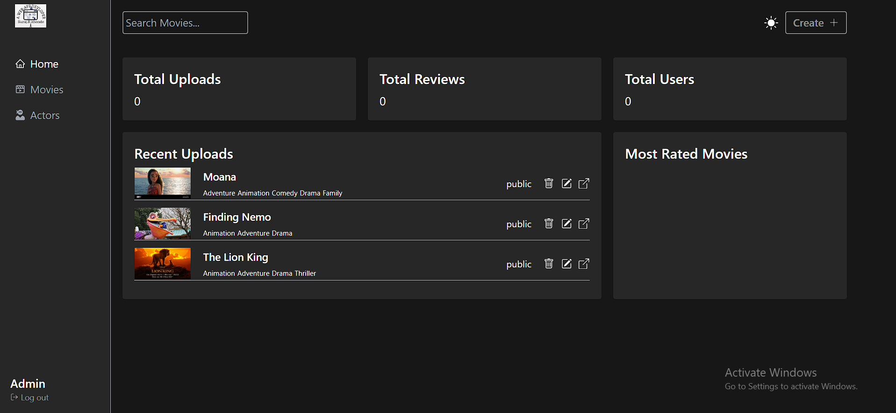

# Dashboard

```javascript
import React, { useEffect, useState } from "react";
import { getAppInfo } from "../../api/admin";
import { useNotification } from "../../hooks";
import AppInfoBox from "../AppInfoBox";
import LatestUploads from "../LatestUploads";
import MostRatedMovies from "../MostRatedMovies";

export default function Dashboard() {
  const [appInfo, setAppInfo] = useState({
    movieCount: 0,
    reviewCount: 0,
    userCount: 0,
  });

  const { updateNotification } = useNotification();

  const fetchAppInfo = async () => {
    const { appInfo, error } = await getAppInfo();

    if (error) return updateNotification("error", error);

    setAppInfo({ ...appInfo });
  };

  useEffect(() => {
    fetchAppInfo();
  }, []);

  return (
    <div className="grid grid-cols-3 gap-5 p-5">
      <AppInfoBox
        title="Total Uploads"
        subTitle={appInfo.movieCount.toLocaleString()}
      />
      <AppInfoBox
        title="Total Reviews"
        subTitle={appInfo.reviewCount.toLocaleString()}
      />
      <AppInfoBox
        title="Total Users"
        subTitle={appInfo.userCount.toLocaleString()}
      />

      <LatestUploads />
      <MostRatedMovies />
    </div>
  );
}

```

<figure><figcaption><p><mark style="color:orange;"><strong>Dashbord</strong></mark></p></figcaption></figure>


[appinfobox.md](../most-common-pages/appinfobox.md)




[latestuploads.md](../most-common-pages/latestuploads.md)




[mostratedmovie.md](../most-common-pages/mostratedmovie.md)

