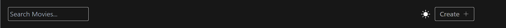
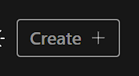

# header

<figure><figcaption></figcaption></figure>

```javascript
import React, { useEffect, useRef, useState } from "react";
import { AiOutlinePlus } from "react-icons/ai";
import { BsFillSunFill } from "react-icons/bs";
import { useNavigate } from "react-router-dom";
import { useTheme } from "../../hooks";
import AppSearchForm from "../form/AppSearchForm";

export default function Header({ onAddActorClick, onAddMovieClick }) {
  const [showOptions, setShowOptions] = useState(false);
  const { toggleTheme } = useTheme();

  const navigate = useNavigate();

  const options = [
    { title: "Add Movie", onClick: onAddMovieClick },
    { title: "Add Actor", onClick: onAddActorClick },
  ];

  const handleSearchSubmit = (query) => {
    if (!query.trim()) return;

    navigate("/search?title=" + query);
  };

  return (
    <div className="flex items-center justify-between relative p-5">
      <AppSearchForm
        onSubmit={handleSearchSubmit}
        placeholder="Search Movies..."
      />

      <div className="flex items-center space-x-3">
        <button
          onClick={toggleTheme}
          className="dark:text-white text-light-subtle"
        >
          <BsFillSunFill size={24} />
        </button>

        <button
          onClick={() => setShowOptions(true)}
          className="flex items-center space-x-2 dark:border-dark-subtle border-light-subtle dark:text-dark-subtle text-light-subtle hover:opacity-80 transition font-semibold border-2 rounded text-lg px-3 py-1"
        >
          <span>Create</span>
          <AiOutlinePlus />
        </button>

        <CreateOptions
          visible={showOptions}
          onClose={() => setShowOptions(false)}
          options={options}
        />
      </div>
    </div>
  );
}

const CreateOptions = ({ options, visible, onClose }) => {
  const container = useRef();
  const containerID = "options-container";

  useEffect(() => {
    const handleClose = (e) => {
      if (!visible) return;
      const { parentElement, id } = e.target;

      if (parentElement.id === containerID || id === containerID) return;

      if (container.current) {
        if (!container.current.classList.contains("animate-scale"))
          container.current.classList.add("animate-scale-reverse");
      }
    };

    document.addEventListener("click", handleClose);
    return () => {
      document.removeEventListener("click", handleClose);
    };
  }, [visible]);

  const handleClick = (fn) => {
    fn();
    onClose();
  };

  if (!visible) return null;

  return (
    <div
      id={containerID}
      ref={container}
      className="absolute right-0 z-50 top-12 flex flex-col space-y-3 p-5 dark:bg-secondary bg-white drop-shadow-lg rounded animate-scale"
      onAnimationEnd={(e) => {
        if (e.target.classList.contains("animate-scale-reverse")) onClose();
        e.target.classList.remove("animate-scale");
      }}
    >
      {options.map(({ title, onClick }) => {
        return (
          <Option key={title} onClick={() => handleClick(onClick)}>
            {title}
          </Option>
        );
      })}
    </div>
  );
};

const Option = ({ children, onClick }) => {
  return (
    <button
      onClick={onClick}
      className="dark:text-white text-secondary hover:opacity-80 transition"
    >
      {children}
    </button>
  );
};

```



[appsearchform.md](../reusable-code/appsearchform.md)


```jsx
const handleSearchSubmit = (query) => {
  // Trim whitespace from the query and check if it's empty
  if (!query.trim()) return; // If the query is empty or contains only whitespace, return early

  // If the query is not empty, navigate to the search page with the query as a parameter
  navigate("/search?title=" + query);
};
```

Overall, this function ensures that an empty or whitespace-only query is not submitted for search, preventing unnecessary requests and providing a better user experience.

<figure><figcaption></figcaption></figure>

```jsx
<div className="flex items-center space-x-3">
        <button
          onClick={toggleTheme}
          className="dark:text-white text-light-subtle"
        >
          <BsFillSunFill size={24} />
        </button>
```



[themecontext.md](../context/themecontext.md)


<figure><figcaption></figcaption></figure>

```jsx
<div
      id={containerID}// Sets the id attribute to the value of containerID variable
      ref={container}  // Sets a ref to the DOM node using the container reference
      className="absolute right-0 z-50 top-12 flex flex-col space-y-3 p-5 dark:bg-secondary bg-white drop-shadow-lg rounded animate-scale"
      onAnimationEnd={(e) => { // Event handler triggered when animation ends
        if (e.target.classList.contains("animate-scale-reverse")) onClose();// Calls onClose() if the animation class "animate-scale-reverse" is present
        e.target.classList.remove("animate-scale"); // Removes the animation class "animate-scale" from the element
  }}
      }}
    >
      {options.map(({ title, onClick }) => {
        return (
          <Option key={title} onClick={() => handleClick(onClick)}>
            {title}
          </Option>
        );
      })}
    </div>
    // Overall, this <div> element likely represents a component 
    // with dynamic styling and animation effects, 
    // possibly used for modal or dropdown functionality.
  );
};

const Option = ({ children, onClick }) => {
  return (
    <button
      onClick={onClick}
      className="dark:text-white text-secondary hover:opacity-80 transition"
    >
      {children}
    </button>
  );
};

```

```jsx

        <button
          onClick={() => setShowOptions(true)}
          className="flex items-center space-x-2 dark:border-dark-subtle border-light-subtle dark:text-dark-subtle text-light-subtle hover:opacity-80 transition font-semibold border-2 rounded text-lg px-3 py-1"
        >
          <span>Create</span>
          <AiOutlinePlus />
        </button>
```

```jsx
<CreateOptions
          visible={showOptions}
          onClose={() => setShowOptions(false)}
          options={options}
        />

  const CreateOptions = ({ options, visible, onClose }) => {
  const container = useRef();
  const containerID = "options-container"; 
  //This line defines a constant containerID with the value "options-container". 
  // This ID will be used to identify the container in the event handling logic.

  useEffect(() => {
    const handleClose = (e) => {
      if (!visible) return;// If the options are not visible, return early
      const { parentElement, id } = e.target;
     // Extract the parentElement and id from the event target
    
      if (parentElement.id === containerID || id === containerID) return;
      // If the click occurred within the options container or its child elements, 
      // return early
       
      if (container.current) {
     // If the click occurred outside the options container and it's not already closing
        if (!container.current.classList.contains("animate-scale"))
         // Code to execute if the class "animate-scale" is NOT present in the classList
          container.current.classList.add("animate-scale-reverse");
          // Add a class to trigger the reverse animation for closing
         
      }
    };
  // Add event listener for click events on the document
    document.addEventListener("click", handleClose);
     // Clean up function to remove event listener when the component unmounts 
     //or visible prop changes
    return () => {
      document.removeEventListener("click", handleClose);
    };
  }, [visible]);
  // Dependency array ensures effect runs when the 'visible' prop changes
  
```

