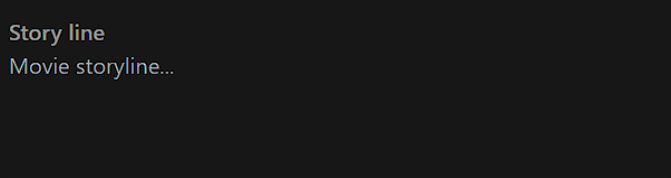

# 🎥 Movies dash

**Admin Look of the Movies page**


<figure><figcaption><p><mark style="color:orange;"><strong>Admin Movie Page</strong></mark></p></figcaption></figure>

<mark style="color:orange;">**Where does the actual movie upload game start ?**</mark>

<figure><figcaption><p><mark style="color:orange;"><strong>Admin add Movie</strong></mark></p></figcaption></figure>

```javascript
export default function AdminNavigator() {
  const [showMovieUploadModal, setShowMovieUploadModal] = useState(false);

 <MovieUpload
        visible={showMovieUploadModal}
        onClose={hideMovieUploadModal}
      />
```

<mark style="color:orange;">**The first time a movie form is called...?**</mark>

When the `movieUpload` function is invoked, the first trailer pops up. Admins use this popup to upload MP4 format videos. We discussed this in the admin tab, so let's delve directly into the code here.

**this is only one package I used 3rd party instead of creating**

```
import { FileUploader } from "react-drag-drop-files";
```

<mark style="color:orange;">**This is return part of the movie uploads**</mark>&#x20;

```javascript

  return (
    <ModalContainer visible={visible}>
      <div className="mb-5">
        <UploadProgress
          visible={!videoUploaded && videoSelected}
          message={getUploadProgressValue()}
          width={uploadProgress}
        />
      </div>
      {!videoSelected ? (
        <TrailerSelector
          visible={!videoSelected}
          onTypeError={handleTypeError}
          handleChange={handleChange}
        />
      ) : (
        <MovieForm busy={busy} onSubmit={!busy ? handleSubmit : null} />
      )}
    </ModalContainer>
  );
```

Handling video trailer uploads involves several steps

```javascript
{!videoSelected ? (
        <TrailerSelector
          visible={!videoSelected}
          onTypeError={handleTypeError}
          handleChange={handleChange}
        />
      ) : (
        <MovieForm busy={busy} onSubmit={!busy ? handleSubmit : null} />
      )}
```

&#x20;


[rollercoaster-of-uplaoding-trailer.md](rollercoaster-of-uplaoding-trailer.md)


\
As directors meticulously oversee every scenario in a movie, I've considered the entire workflow for creating my movie form. First on the task list is handling the trailer video upload. Why, you ask? Well, video uploading is a time-consuming process, so I've got that running in the background while I dive into filling out the form, as shown in the image.

Now, let's address the elephant in the room – the trailer quality. It might not be top-notch because I don't have a ton of storage data on cloudinary (they're a bit stingy with the free space, just like a cameo appearance), but fear not! I've got the logic all figured out.

Lights, camera, action! 🎬💻 Don't worry about the trailer; we're making movie magic happen here! 🌟✨

<figure><figcaption><p><mark style="color:orange;"><strong>Trailer upload form</strong></mark></p></figcaption></figure>

I've added a sleek <mark style="color:blue;">**Drag-and-Drop**</mark> feature above the image for an effortless file upload experience. Just click on the image, and you'll seamlessly navigate to the file structure, ready to upload your trailer. Once the upload begins, you'll be redirected to the movie form, complete with a progress bar at the top, showing you the upload completion status.


Given the mammoth sizes of 4K files these days, we understand waiting isn't everyone's cup of tea. Fear not! While your internet connection and the file size determine the upload time, I've got you covered. <mark style="color:blue;">Use this time wisely – start filling out the form.</mark> And guess what? As soon as you're done, App  will shoot you a notification! Lights, camera, multitask! 🚀💻✨

Brace yourself for a symphony of syntax, where each line plays a crucial role in creating a seamless user experience.

**Behold, the maestro of multitasking**

<figure><figcaption><p><mark style="color:red;"><strong><code>MovieForm</code></strong></mark></p></figcaption></figure>

```javascript
impo React, { useEffect, useState } from "react";
import { useNotification } from "../../hooks";
import {
  languageOptions,
  statusOptions,
  typeOptions,
} from "../../utils/options";
import { commonInputClasses } from "../../utils/theme";
import { validateMovie } from "../../utils/validator";
import DirectorSelector from "../DirectorSelector";
import CastForm from "../form/CastForm";
import Submit from "../form/Submit";
import GenresSelector from "../GenresSelector";
import Label from "../Label";
import LabelWithBadge from "../LabelWithBadge";
import CastModal from "../models/CastModel";
import GenresModal from "../models/GenresModel";
import WritersModal from "../models/WritersModal";
import PosterSelector from "../PosterSelector";
import Selector from "../Selector";
import TagsInput from "../TagsInput";
import ViewAllBtn from "../ViewAllButton";
import WriterSelector from "../WriterSelector";

const defaultMovieInfo = {
  title: "",
  storyLine: "",
  tags: [],
  cast: [],
  director: {},
  writers: [],
  releseDate: "",
  poster: null,
  genres: [],
  type: "",
  language: "",
  status: "",
};

export default function MovieForm({ busy, btnTitle, initialState, onSubmit }) {
  const [movieInfo, setMovieInfo] = useState({ ...defaultMovieInfo });
  const [showWritersModal, setShowWritersModal] = useState(false);
  const [showCastModal, setShowCastModal] = useState(false);
  const [selectedPosterForUI, setSelectedPosterForUI] = useState("");
  const [showGenresModal, setShowGenresModal] = useState(false);

  const { updateNotification } = useNotification();

  const handleSubmit = (e) => {
    e.preventDefault();
    const { error } = validateMovie(movieInfo);
    if (error) return updateNotification("error", error);

    // cast, tags, genres, writers
    const { tags, genres, cast, writers, director, poster } = movieInfo;

    const formData = new FormData();
    const finalMovieInfo = {
      ...movieInfo,
    };

    finalMovieInfo.tags = JSON.stringify(tags);
    finalMovieInfo.genres = JSON.stringify(genres);
    

    // {
    //   actor: { type: mongoose.Schema.Types.ObjectId, ref: "Actor" },
    //   roleAs: String,
    //   leadActor: Boolean,
    // },
    console.log(finalMovieInfo)
    const finalCast = cast.map((c) => ({
      actor: c.profile.id,
      roleAs: c.roleAs,
      leadActor: c.leadActor,
    }));
    finalMovieInfo.cast = JSON.stringify(finalCast);

    if (writers.length) {
      const finalWriters = writers.map((w) => w.id);
      finalMovieInfo.writers = JSON.stringify(finalWriters);
    }

    if (director.id) finalMovieInfo.director = director.id;
    if (poster) finalMovieInfo.poster = poster;

    for (let key in finalMovieInfo) {
      formData.append(key, finalMovieInfo[key]);
    }

    onSubmit(formData);
  };

  const updatePosterForUI = (file) => {
    const url = URL.createObjectURL(file);
    setSelectedPosterForUI(url);
  };

  const handleChange = ({ target }) => {
    const { value, name, files } = target;
    if (name === "poster") {
      const poster = files[0];
      updatePosterForUI(poster);
      return setMovieInfo({ ...movieInfo, poster });
    }

    setMovieInfo({ ...movieInfo, [name]: value });
  };

  const updateTags = (tags) => {
    setMovieInfo({ ...movieInfo, tags });
  };

  const updateDirector = (profile) => {
    setMovieInfo({ ...movieInfo, director: profile });
  };

  const updateCast = (castInfo) => {
    const { cast } = movieInfo;
    setMovieInfo({ ...movieInfo, cast: [...cast, castInfo] });
  };

  const updateGenres = (genres) => {
    setMovieInfo({ ...movieInfo, genres });
  };

  const updateWriters = (profile) => {
    const { writers } = movieInfo;
    for (let writer of writers) {
      if (writer.id === profile.id) {
        return updateNotification(
          "warning",
          "This profile is already selected!"
        );
      }
    }
    setMovieInfo({ ...movieInfo, writers: [...writers, profile] });
  };

  const hideWritersModal = () => {
    setShowWritersModal(false);
  };

  const displayWritersModal = () => {
    setShowWritersModal(true);
  };

  const hideCastModal = () => {
    setShowCastModal(false);
  };

  const displayCastModal = () => {
    setShowCastModal(true);
  };

  const hideGenresModal = () => {
    setShowGenresModal(false);
  };

  const displayGenresModal = () => {
    setShowGenresModal(true);
  };

  const handleWriterRemove = (profileId) => {
    const { writers } = movieInfo;
    const newWriters = writers.filter(({ id }) => id !== profileId);
    if (!newWriters.length) hideWritersModal();
    setMovieInfo({ ...movieInfo, writers: [...newWriters] });
  };

  const handleCastRemove = (profileId) => {
    const { cast } = movieInfo;
    const newCast = cast.filter(({ profile }) => profile.id !== profileId);
    if (!newCast.length) hideCastModal();
    setMovieInfo({ ...movieInfo, cast: [...newCast] });
  };

  useEffect(() => {
    if (initialState) {
      setMovieInfo({
        ...initialState,
        releseDate: initialState.releseDate.split("T")[0],
        poster: null,
      });
      setSelectedPosterForUI(initialState.poster);
    }
  }, [initialState]);

  const {
    title,
    storyLine,
    writers,
    cast,
    tags,
    releseDate,
    genres,
    type,
    language,
    status,
  } = movieInfo;

  return (
    <>
      <div onSubmit={handleSubmit} className="flex space-x-3">
        <div className="w-[70%] space-y-5">
          <div>
            <Label htmlFor="title">Title</Label>
            <input
              id="title"
              value={title}
              onChange={handleChange}
              name="title"
              type="text"
              className={
                commonInputClasses + " border-b-2 font-semibold text-xl"
              }
              placeholder="Titanic"
            />
          </div>

          <div>
            <Label htmlFor="storyLine">Story line</Label>
            <textarea
              value={storyLine}
              onChange={handleChange}
              name="storyLine"
              id="storyLine"
              className={commonInputClasses + " border-b-2 resize-none h-24"}
              placeholder="Movie storyline..."
            ></textarea>
          </div>

          <div>
            <Label htmlFor="tags">Tags</Label>
            <TagsInput value={tags} name="tags" onChange={updateTags} />
          </div>

          <DirectorSelector onSelect={updateDirector} />

          <div className="">
            <div className="flex justify-between">
              <LabelWithBadge badge={writers.length} htmlFor="writers">
                Writers
              </LabelWithBadge>
              <ViewAllBtn
                onClick={displayWritersModal}
                visible={writers.length}
              >
                View All
              </ViewAllBtn>
            </div>
            <WriterSelector onSelect={updateWriters} />
          </div>

          <div>
            <div className="flex justify-between">
              <LabelWithBadge badge={cast.length}>
                Add Cast & Crew
              </LabelWithBadge>
              <ViewAllBtn onClick={displayCastModal} visible={cast.length}>
                View All
              </ViewAllBtn>
            </div>
            <CastForm onSubmit={updateCast} />
          </div>

          <input
            type="date"
            className={commonInputClasses + " border-2 rounded p-1 w-auto"}
            onChange={handleChange}
            name="releseDate"
            value={releseDate}
          />

          <Submit
            busy={busy}
            value={btnTitle}
            onClick={handleSubmit}
            type="button"
          />
        </div>
        <div className="w-[30%] space-y-5">
          <PosterSelector
            name="poster"
            onChange={handleChange}
            selectedPoster={selectedPosterForUI}
            lable="Select poster"
            accept="image/jpg, image/jpeg, image/png"
          />
          <GenresSelector badge={genres.length} onClick={displayGenresModal} />

          <Selector
            onChange={handleChange}
            name="type"
            value={type}
            options={typeOptions}
            label="Type"
          />
          <Selector
            onChange={handleChange}
            name="language"
            value={language}
            options={languageOptions}
            label="Language"
          />
          <Selector
            onChange={handleChange}
            name="status"
            value={status}
            options={statusOptions}
            label="Status"
          />
        </div>
      </div>

      <WritersModal
        onClose={hideWritersModal}
        visible={showWritersModal}
        profiles={writers}
        onRemoveClick={handleWriterRemove}
      />

      <CastModal
        onClose={hideCastModal}
        casts={cast}
        visible={showCastModal}
        onRemoveClick={handleCastRemove}
      />
      <GenresModal
        onSubmit={updateGenres}
        visible={showGenresModal}
        onClose={hideGenresModal}
        previousSelection={genres}
      />
    </>
  );
}

```

Our code is a rockstar, managing a bunch of tasks flawlessly. are you ready to dig deeper if there's more to uncover. Lay it on me!

<figure><figcaption></figcaption></figure>

this is left side form of the main form

<figure><figcaption></figcaption></figure>

The `<textarea>` tag defines a multi-line text input control.The `<textarea>` element is often used in a form, to collect user inputs like comments or reviews.


```jsx
  <div>
            <Label htmlFor="storyLine">Story line</Label>
            <textarea
              value={storyLine}
              onChange={handleChange}
              name="storyLine"
              id="storyLine"
              className={commonInputClasses + " border-b-2 resize-none h-24"}
              placeholder="Movie storyline..."
            ></textarea>
      
```

&#x20;\#Tags

```jsx
import TagsInput from "../TagsInput";
 const updateTags = (tags) => {
    setMovieInfo({ ...movieInfo, tags });
  };
  <div>
    <Label htmlFor="tags">Tags</Label>
    <TagsInput value={tags} name="tags" onChange={updateTags} />
  </div>

```


[tagsinput.md](../../reusable-code/tagsinput.md)


Writer \&Direactor have similar story in our App

<figure><figcaption><p>Directors &#x26;&#x26;Writer</p></figcaption></figure>

```jsx
<DirectorSelector onSelect={updateDirector} />

          <div className="">
            <div className="flex justify-between">
              <LabelWithBadge badge={writers.length} htmlFor="writers">
                Writers
              </LabelWithBadge>
              <ViewAllBtn
                onClick={displayWritersModal}
                visible={writers.length}
              >
                View All
              </ViewAllBtn>
            </div>
            <WriterSelector onSelect={updateWriters} />
          </div>

```



[director.md](movieform/director.md)



[labelwithbadge.md](labelwithbadge.md)



[writerselector.md](writerselector.md)



[viewallbtn.md](viewallbtn.md)


[rollercoaster-of-uplaoding-trailer.md](rollercoaster-of-uplaoding-trailer.md "mention")


Now, let's dive into the fun part – filling out the form below. Look at it like a big, exciting adventure with lots of fields to fill in. It's like a sky full of stars, and each field is like a star that adds sparkle to your movie.

Start with the title, set the vibe. Then, tell your story in the storyline section, and pick the genres that match the feelings you want to convey. Think of the actor arrays as your awesome cast – choose them wisely, just like picking your dream team.

Get ready, scriptwriter! The form is like a canvas waiting for your creative strokes. Every word you type and every choice you make builds a scene, creating your movie step by step. So, let's get started and bring your film to life, one field at a time! 🚀🎥🌌 \
Note :-<mark style="color:orange;">While it may seem easy, trust me, as a developer, it's been a real journey. I've gone through multiple rounds of trial and error, but here we are – the results are right in front of you.</mark>

The `<textarea>` element is often used in a form, to collect user inputs like comments or reviews.

A text area can hold an unlimited number of characters, and the text renders in a fixed-width font (usually Courier).


[movieform](movieform/)


```
 useEffect(() => {
    if (initialState) {
      setMovieInfo({
        ...initialState,
        releseDate: initialState.releseDate.split("T")[0],
        poster: null,
      });
      setSelectedPosterForUI(initialState.poster);
    }
  }, [initialState]);
```


In summary, this `useEffect` is triggered when the component mounts or when `initialState` changes. If `initialState` is truthy, it updates the state variables `movieInfo` and `selectedPosterForUI` based on the properties of the `initialState` object. The `releseDate` property is modified to remove the time information, and the `poster` property is set to `null` in `movieInfo`. The original `poster` value is set for `selectedPosterForUI`.

```
import { commonInputClasses } from "../../utils/theme";
import { validateMovie } from "../../utils/validator";
import DirectorSelector from "../DirectorSelector";
import CastForm from "../form/CastForm";
import Submit from "../form/Submit";
import GenresSelector from "../GenresSelector";
import Label from "../Label";
import LabelWithBadge from "../LabelWithBadge";
import CastModal from "../models/CastModel";
import GenresModal from "../models/GenresModel";
import WritersModal from "../models/WritersModal";
import PosterSelector from "../PosterSelector";
import Selector from "../Selector";
import TagsInput from "../TagsInput";
import ViewAllBtn from "../ViewAllButton";
import WriterSelector from "../WriterSelector";            
```



[director.md](movieform/director.md)




[castmodal.md](castmodal.md)




[label.md](label.md)




[labelwithbadge.md](labelwithbadge.md)


&#x20;


[genres.md](movieform/genres.md)




[writersmodal.md](writersmodal.md)


