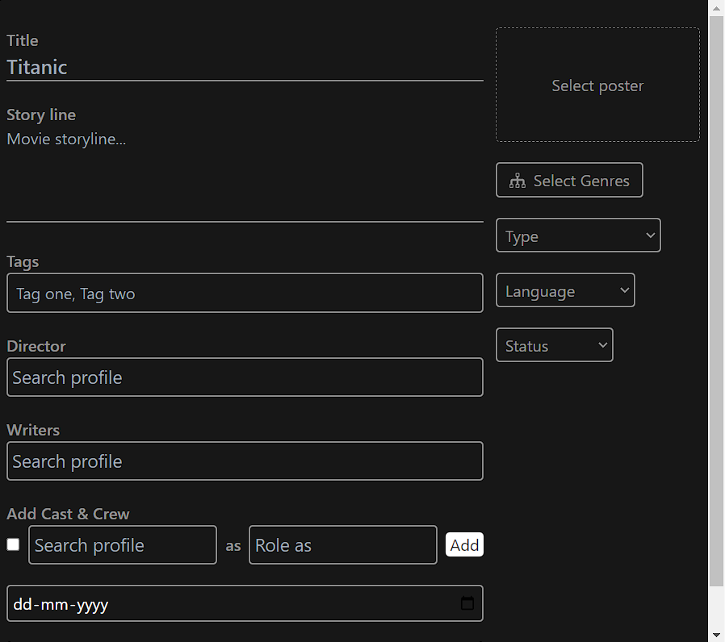

# 🙋 MovieForm

<figure><figcaption><p><mark style="color:red;"><strong>Movie Form</strong></mark></p></figcaption></figure>

```javascript
(
    <>
      <div onSubmit={handleSubmit} className="flex space-x-3">
        <div className="w-[70%] space-y-5">
          <div>
            <Label htmlFor="title">Title</Label>
            <input
              id="title"
              value={title}
              onChange={handleChange}
              name="title"
              type="text"
              className={
                commonInputClasses + " border-b-2 font-semibold text-xl"
              }
              placeholder="Titanic"
            />
          </div>

          <div>
            <Label htmlFor="storyLine">Story line</Label>
            <textarea
              value={storyLine}
              onChange={handleChange}
              name="storyLine"
              id="storyLine"
              className={commonInputClasses + " border-b-2 resize-none h-24"}
              placeholder="Movie storyline..."
            ></textarea>
          </div>

          <div>
            <Label htmlFor="tags">Tags</Label>
            <TagsInput value={tags} name="tags" onChange={updateTags} />
          </div>

          <DirectorSelector onSelect={updateDirector} />

          <div className="">
            <div className="flex justify-between">
              <LabelWithBadge badge={writers.length} htmlFor="writers">
                Writers
              </LabelWithBadge>
              <ViewAllBtn
                onClick={displayWritersModal}
                visible={writers.length}
              >
                View All
              </ViewAllBtn>
            </div>
            <WriterSelector onSelect={updateWriters} />
          </div>

          <div>
            <div className="flex justify-between">
              <LabelWithBadge badge={cast.length}>
                Add Cast & Crew
              </LabelWithBadge>
              <ViewAllBtn onClick={displayCastModal} visible={cast.length}>
                View All
              </ViewAllBtn>
            </div>
            <CastForm onSubmit={updateCast} />
          </div>

          <input
            type="date"
            className={commonInputClasses + " border-2 rounded p-1 w-auto"}
            onChange={handleChange}
            name="releseDate"
            value={releseDate}
          />

          <Submit
            busy={busy}
            value={btnTitle}
            onClick={handleSubmit}
            type="button"
          />
        </div>
        <div className="w-[30%] space-y-5">
          <PosterSelector
            name="poster"
            onChange={handleChange}
            selectedPoster={selectedPosterForUI}
            lable="Select poster"
            accept="image/jpg, image/jpeg, image/png"
          />
          <GenresSelector badge={genres.length} onClick={displayGenresModal} />

          <Selector
            onChange={handleChange}
            name="type"
            value={type}
            options={typeOptions}
            label="Type"
          />
          <Selector
            onChange={handleChange}
            name="language"
            value={language}
            options={languageOptions}
            label="Language"
          />
          <Selector
            onChange={handleChange}
            name="status"
            value={status}
            options={statusOptions}
            label="Status"
          />
        </div>
      </div>

      <WritersModal
        onClose={hideWritersModal}
        visible={showWritersModal}
        profiles={writers}
        onRemoveClick={handleWriterRemove}
      />

      <CastModal
        onClose={hideCastModal}
        casts={cast}
        visible={showCastModal}
        onRemoveClick={handleCastRemove}
      />
      <GenresModal
        onSubmit={updateGenres}
        visible={showGenresModal}
        onClose={hideGenresModal}
        previousSelection={genres}
      />
    </>
  );
```

```javascript
const handleSubmit = (e) => {
    e.preventDefault();
    const { error } = validateMovie(movieInfo);
    if (error) return updateNotification("error", error);

    // cast, tags, genres, writers
    const { tags, genres, cast, writers, director, poster } = movieInfo;

    const formData = new FormData();
    const finalMovieInfo = {
      ...movieInfo,
    };
```

<mark style="color:orange;">**Admin slaps in that movie data, but here comes the superhero developer, armed with the ValidateMovies validator, ready to make sure that form is as sturdy as a fortres.**</mark>

const formData = new FormData();\
This line creates a new `FormData` object. `FormData` is a built-in JavaScript object that allows you to easily construct a set of key/value pairs representing form fields and their values.



[validatemovie.md](validatemovie.md)


<mark style="color:orange;">**handleChange**</mark>\


```javascript
const handleChange = ({ target }) => {
    const { value, name, files } = target;
    if (name === "poster") {
      const poster = files[0];
      updatePosterForUI(poster);
      return setMovieInfo({ ...movieInfo, poster });
    }
    setMovieInfo({ ...movieInfo, [name]: value });
  };
```

```javascript
const updatePosterForUI = (file) => {
    const url = URL.createObjectURL(file);
    setSelectedPosterForUI(url);
  };
```

`const url = URL.createObjectURL(file);`: This line creates a URL for the given `file` using the `URL.createObjectURL()` method. This method creates a DOMString representing a URL that represents the object given in the parameter.


**how to eat an elephant🐘 , piece by piece**&#x20;

let's handle first <mark style="color:red;">Tags</mark>

In the movie world, tags like horror, action, romance, and more serve as labels or descriptors that categorize films based on their genre or themes. If you take a glance at the <mark style="color:orange;">tag field</mark>, you might initially perceive it as an input field. However, it's more than that – it's a container playing host to a span, serving as the visual representation of a <mark style="color:orange;">tag</mark>, accompanied by an input field for adding new tags. It's like a backstage pass for organizing movies into their thematic VIP sections. 🎬✨ &#x20;

<mark style="color:green;">Diving into the</mark> <mark style="color:red;">**tag**</mark> <mark style="color:green;">creation process is akin to exploring the inner workings of a movie magic workshop. Here's you go</mark>

```javascript
const updateTags = (tags) => {
    setMovieInfo({ ...movieInfo, tags });
  };
```



[tags.md](tags.md)


<mark style="color:orange;">**Directors**</mark> are the maestros of the movie, orchestrating its entire flow. Similarly, developers act as the conductors of code, ensuring every part harmonizes seamlessly. Just like a missed detail by a director can impact a film, a tiny bug left in the code will come back to hunt you down. It's a high-energy dance of creativity and precision in both worlds! 🎬💻&#x20;

```
 <DirectorSelector onSelect={updateDirector} />
```

```javascript
const updateDirector = (profile) => {
    setMovieInfo({ ...movieInfo, director: profile });
  };
```


[director.md](director.md)


<mark style="color:orange;">**cast and crew**</mark> \
In the grand production of software development, the <mark style="color:purple;">cast and crew</mark> play pivotal roles. Think of React, Node, Mongoose, and Express as the dynamic crew, each with its unique strength, working together seamlessly. And, of course, in the leading role, we have JavaScript—the main hero, the linchpin holding this blockbuster together. So, just as a well-coordinated cast and crew ensure a movie's success, this JavaScript ensemble guarantees an epic software development journey! 🚀💻



[cast-and-crew.md](cast-and-crew.md)


<mark style="color:orange;">**Genres**</mark>\


finally Let's see what final code of the movie form&#x20;


[genres.md](genres.md)


```javascript
import React, { useEffect, useState } from "react";
import { useNotification } from "../../hooks";
import {
  languageOptions,
  statusOptions,
  typeOptions,
} from "../../utils/options";
import { commonInputClasses } from "../../utils/theme";
import { validateMovie } from "../../utils/validator";
import DirectorSelector from "../DirectorSelector";
import CastForm from "../form/CastForm";
import Submit from "../form/Submit";
import GenresSelector from "../GenresSelector";
import Label from "../Label";
import LabelWithBadge from "../LabelWithBadge";
import CastModal from "../models/CastModel";
import GenresModal from "../models/GenresModel";
import WritersModal from "../models/WritersModal";
import PosterSelector from "../PosterSelector";
import Selector from "../Selector";
import TagsInput from "../TagsInput";
import ViewAllBtn from "../ViewAllButton";
import WriterSelector from "../WriterSelector";

const defaultMovieInfo = {
  title: "",
  storyLine: "",
  tags: [],
  cast: [],
  director: {},
  writers: [],
  releseDate: "",
  poster: null,
  genres: [],
  type: "",
  language: "",
  status: "",
};

export default function MovieForm({ busy, btnTitle, initialState, onSubmit }) {
  const [movieInfo, setMovieInfo] = useState({ ...defaultMovieInfo });
  const [showWritersModal, setShowWritersModal] = useState(false);
  const [showCastModal, setShowCastModal] = useState(false);
  const [selectedPosterForUI, setSelectedPosterForUI] = useState("");
  const [showGenresModal, setShowGenresModal] = useState(false);

  const { updateNotification } = useNotification();

  const handleSubmit = (e) => {
    e.preventDefault();
    const { error } = validateMovie(movieInfo);
    if (error) return updateNotification("error", error);

    // cast, tags, genres, writers
    const { tags, genres, cast, writers, director, poster } = movieInfo;

    const formData = new FormData();
    const finalMovieInfo = {
      ...movieInfo,
    };

    finalMovieInfo.tags = JSON.stringify(tags);
    finalMovieInfo.genres = JSON.stringify(genres);
    

    // {
    //   actor: { type: mongoose.Schema.Types.ObjectId, ref: "Actor" },
    //   roleAs: String,
    //   leadActor: Boolean,
    // },
    console.log(finalMovieInfo)
    const finalCast = cast.map((c) => ({
      actor: c.profile.id,
      roleAs: c.roleAs,
      leadActor: c.leadActor,
    }));
    finalMovieInfo.cast = JSON.stringify(finalCast);

    if (writers.length) {
      const finalWriters = writers.map((w) => w.id);
      finalMovieInfo.writers = JSON.stringify(finalWriters);
    }

    if (director.id) finalMovieInfo.director = director.id;
    if (poster) finalMovieInfo.poster = poster;

    for (let key in finalMovieInfo) {
      formData.append(key, finalMovieInfo[key]);
    }

    onSubmit(formData);
  };

  const updatePosterForUI = (file) => {
    const url = URL.createObjectURL(file);
    setSelectedPosterForUI(url);
  };

  const handleChange = ({ target }) => {
    const { value, name, files } = target;
    if (name === "poster") {
      const poster = files[0];
      updatePosterForUI(poster);
      return setMovieInfo({ ...movieInfo, poster });
    }

    setMovieInfo({ ...movieInfo, [name]: value });
  };

  const updateTags = (tags) => {
    setMovieInfo({ ...movieInfo, tags });
  };

  const updateDirector = (profile) => {
    setMovieInfo({ ...movieInfo, director: profile });
  };

  const updateCast = (castInfo) => {
    const { cast } = movieInfo;
    setMovieInfo({ ...movieInfo, cast: [...cast, castInfo] });
  };

  const updateGenres = (genres) => {
    setMovieInfo({ ...movieInfo, genres });
  };

  const updateWriters = (profile) => {
    const { writers } = movieInfo;
    for (let writer of writers) {
      if (writer.id === profile.id) {
        return updateNotification(
          "warning",
          "This profile is already selected!"
        );
      }
    }
    setMovieInfo({ ...movieInfo, writers: [...writers, profile] });
  };

  const hideWritersModal = () => {
    setShowWritersModal(false);
  };

  const displayWritersModal = () => {
    setShowWritersModal(true);
  };

  const hideCastModal = () => {
    setShowCastModal(false);
  };

  const displayCastModal = () => {
    setShowCastModal(true);
  };

  const hideGenresModal = () => {
    setShowGenresModal(false);
  };

  const displayGenresModal = () => {
    setShowGenresModal(true);
  };

  const handleWriterRemove = (profileId) => {
    const { writers } = movieInfo;
    const newWriters = writers.filter(({ id }) => id !== profileId);
    if (!newWriters.length) hideWritersModal();
    setMovieInfo({ ...movieInfo, writers: [...newWriters] });
  };

  const handleCastRemove = (profileId) => {
    const { cast } = movieInfo;
    const newCast = cast.filter(({ profile }) => profile.id !== profileId);
    if (!newCast.length) hideCastModal();
    setMovieInfo({ ...movieInfo, cast: [...newCast] });
  };

  useEffect(() => {
    if (initialState) {
      setMovieInfo({
        ...initialState,
        releseDate: initialState.releseDate.split("T")[0],
        poster: null,
      });
      setSelectedPosterForUI(initialState.poster);
    }
  }, [initialState]);

  const {
    title,
    storyLine,
    writers,
    cast,
    tags,
    releseDate,
    genres,
    type,
    language,
    status,
  } = movieInfo;

  return (
    <>
      <div onSubmit={handleSubmit} className="flex space-x-3">
        <div className="w-[70%] space-y-5">
          <div>
            <Label htmlFor="title">Title</Label>
            <input
              id="title"
              value={title}
              onChange={handleChange}
              name="title"
              type="text"
              className={
                commonInputClasses + " border-b-2 font-semibold text-xl"
              }
              placeholder="Titanic"
            />
          </div>

          <div>
            <Label htmlFor="storyLine">Story line</Label>
            <textarea
              value={storyLine}
              onChange={handleChange}
              name="storyLine"
              id="storyLine"
              className={commonInputClasses + " border-b-2 resize-none h-24"}
              placeholder="Movie storyline..."
            ></textarea>
          </div>

          <div>
            <Label htmlFor="tags">Tags</Label>
            <TagsInput value={tags} name="tags" onChange={updateTags} />
          </div>

          <DirectorSelector onSelect={updateDirector} />

          <div className="">
            <div className="flex justify-between">
              <LabelWithBadge badge={writers.length} htmlFor="writers">
                Writers
              </LabelWithBadge>
              <ViewAllBtn
                onClick={displayWritersModal}
                visible={writers.length}
              >
                View All
              </ViewAllBtn>
            </div>
            <WriterSelector onSelect={updateWriters} />
          </div>

          <div>
            <div className="flex justify-between">
              <LabelWithBadge badge={cast.length}>
                Add Cast & Crew
              </LabelWithBadge>
              <ViewAllBtn onClick={displayCastModal} visible={cast.length}>
                View All
              </ViewAllBtn>
            </div>
            <CastForm onSubmit={updateCast} />
          </div>

          <input
            type="date"
            className={commonInputClasses + " border-2 rounded p-1 w-auto"}
            onChange={handleChange}
            name="releseDate"
            value={releseDate}
          />

          <Submit
            busy={busy}
            value={btnTitle}
            onClick={handleSubmit}
            type="button"
          />
        </div>
        <div className="w-[30%] space-y-5">
          <PosterSelector
            name="poster"
            onChange={handleChange}
            selectedPoster={selectedPosterForUI}
            lable="Select poster"
            accept="image/jpg, image/jpeg, image/png"
          />
          <GenresSelector badge={genres.length} onClick={displayGenresModal} />

          <Selector
            onChange={handleChange}
            name="type"
            value={type}
            options={typeOptions}
            label="Type"
          />
          <Selector
            onChange={handleChange}
            name="language"
            value={language}
            options={languageOptions}
            label="Language"
          />
          <Selector
            onChange={handleChange}
            name="status"
            value={status}
            options={statusOptions}
            label="Status"
          />
        </div>
      </div>

      <WritersModal
        onClose={hideWritersModal}
        visible={showWritersModal}
        profiles={writers}
        onRemoveClick={handleWriterRemove}
      />

      <CastModal
        onClose={hideCastModal}
        casts={cast}
        visible={showCastModal}
        onRemoveClick={handleCastRemove}
      />
      <GenresModal
        onSubmit={updateGenres}
        visible={showGenresModal}
        onClose={hideGenresModal}
        previousSelection={genres}
      />
    </>
  );
}

```

