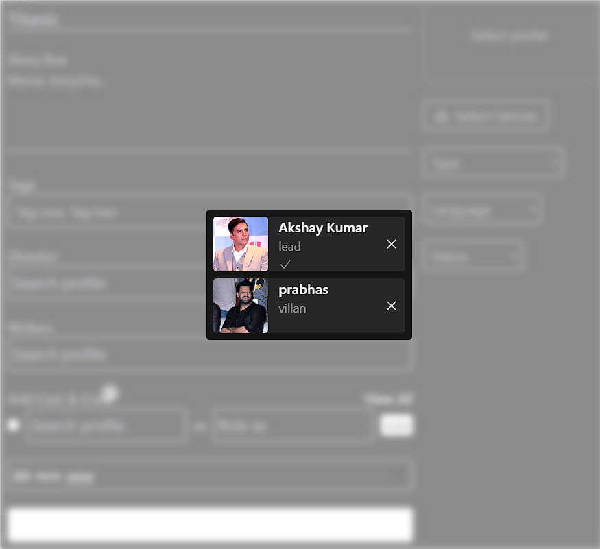

# cast and crew

<figure><figcaption><p><mark style="color:orange;"><strong>Cast &#x26;&#x26; crew</strong></mark></p></figcaption></figure>

```javascript
import React from "react";
import { AiOutlineCheck, AiOutlineClose } from "react-icons/ai";
import ModalContainer from "./ModalContainer";

export default function CastModal({
  casts = [],
  visible,
  onClose,
  onRemoveClick,
}) {
  return (
    <ModalContainer ignoreContainer onClose={onClose} visible={visible}>
      <div className="space-y-2 dark:bg-primary bg-white rounded max-w-[45rem] max-h-[40rem] overflow-auto p-2 custom-scroll-bar">
        {casts.map(({ profile, roleAs, leadActor }) => {
          const { name, avatar, id } = profile;
          return (
            <div
              key={id}
              className="flex space-x-3 dark:bg-secondary bg-white drop-shadow-md rounded"
            >
              
              <div className="w-full flex flex-col justify-between">
                <div>
                  <p className="font-semibold dark:text-white text-primary">
                    {name}
                  </p>
                  <p className="text-sm dark:text-dark-subtle text-light-subtle">
                    {roleAs}
                  </p>
                </div>
                {leadActor && (
                  <AiOutlineCheck className="text-light-subtle dark:text-dark-subtle" />
                )}
              </div>
              <button
                onClick={() => onRemoveClick(id)}
                className="dark:text-white text-primary hover:opacity-80 transition p-2"
              >
                <AiOutlineClose />
              </button>
            </div>
          );
        })}
      </div>
    </ModalContainer>
  );
}

```
