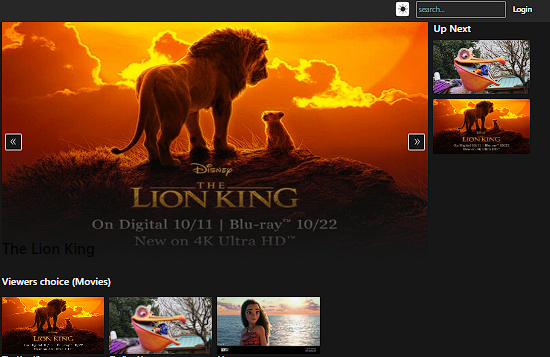

# 🦸 HeroSlidShow

<figure><figcaption></figcaption></figure>

```javascript
import React, { useState, useEffect, useRef, forwardRef } from "react";
import { AiOutlineDoubleLeft, AiOutlineDoubleRight } from "react-icons/ai";
import { Link } from "react-router-dom";
import { getLatestUploads } from "../../api/movie";
import { useNotification } from "../../hooks/index";

let count = 0;
let intervalId;

let newTime = 0;
let lastTime = 0;

export default function HeroSlidShow() {
  const [currentSlide, setCurrentSlide] = useState({});
  const [clonedSlide, setClonedSlide] = useState({});
  const [slides, setSlides] = useState([]);
  const [upNext, setUpNext] = useState([]);
  const [visible, setVisible] = useState(true);
  const slideRef = useRef();
  const clonedSlideRef = useRef();

  const { updateNotification } = useNotification();

  const fetchLatestUploads = async (signal) => {
    const { error, movies } = await getLatestUploads(signal);
    if (error) return updateNotification("error", error);

    setSlides([...movies]);
    setCurrentSlide(movies[0]);
  };

  const startSlideShow = () => {
    intervalId = setInterval(() => {
      newTime = Date.now();
      const delta = newTime - lastTime;
      if (delta < 4000) return clearInterval(intervalId);
      handleOnNextClick();
    }, 3500);
  };

  const pauseSlideShow = () => {
    clearInterval(intervalId);
  };

  const updateUpNext = (currentIndex) => {
    if (!slides.length) return;

    const upNextCount = currentIndex + 1;
    const end = upNextCount + 3;

    let newSlides = [...slides];
    newSlides = newSlides.slice(upNextCount, end);

    if (!newSlides.length) {
      newSlides = [...slides].slice(0, 3);
    }

    setUpNext([...newSlides]);
  };

  //0,1,2,3,4
  const handleOnNextClick = () => {
    lastTime = Date.now();
    pauseSlideShow();
    setClonedSlide(slides[count]);
    count = (count + 1) % slides.length;
    setCurrentSlide(slides[count]);

    clonedSlideRef.current.classList.add("slide-out-to-left");
    slideRef.current.classList.add("slide-in-from-right");
    updateUpNext(count);
  };

  const handleOnPrevClick = () => {
    pauseSlideShow();
    setClonedSlide(slides[count]);
    count = (count + slides.length - 1) % slides.length;

    setCurrentSlide(slides[count]);
    clonedSlideRef.current.classList.add("slide-out-to-right");
    slideRef.current.classList.add("slide-in-from-left");
    updateUpNext(count);
  };

  const handleAnimationEnd = () => {
    const classes = [
      "slide-out-to-left",
      "slide-in-from-right",
      "slide-out-to-right",
      "slide-in-from-left",
    ];
    slideRef.current.classList.remove(...classes);
    clonedSlideRef.current.classList.remove(...classes);
    setClonedSlide({});
    startSlideShow();
  };

  const handleOnVisibilityChange = () => {
    const visibility = document.visibilityState;
    if (visibility === "hidden") setVisible(false);
    if (visibility === "visible") setVisible(true);
  };

  useEffect(() => {
    const ac = new AbortController();
    fetchLatestUploads(ac.signal);
    document.addEventListener("visibilitychange", handleOnVisibilityChange);

    return () => {
      pauseSlideShow();
      document.removeEventListener(
        "visibilitychange",
        handleOnVisibilityChange
      );
      ac.abort();
    };
  }, []);

  useEffect(() => {
    if (slides.length && visible) {
      startSlideShow();
      updateUpNext(count);
    } else pauseSlideShow();
  }, [slides.length, visible]);

  return (
    <div className="w-full flex">
      {/* Slide show section */}
      <div className="md:w-4/5 w-full aspect-video relative overflow-hidden">
        {/* current slide */}
        <Slide
          ref={slideRef}
          title={currentSlide?.title}
          src={currentSlide?.poster}
          id={currentSlide?.id}
        />

        {/* cloned slide */}
        <Slide
          ref={clonedSlideRef}
          onAnimationEnd={handleAnimationEnd}
          className="absolute inset-0"
          src={clonedSlide?.poster}
          title={clonedSlide?.title}
          id={currentSlide?.id}
        />

        <SlideShowController
          onNextClick={handleOnNextClick}
          onPrevClick={handleOnPrevClick}
        />
      </div>

      {/* Up Next Section */}
      <div className="w-1/5 md:block hidden space-y-3 px-3">
        <h1 className="font-semibold text-2xl text-primary dark:text-white">
          Up Next
        </h1>
        {upNext.map(({ poster, id }) => {
          return (
            
          );
        })}
      </div>
    </div>
  );
}

const SlideShowController = ({ onNextClick, onPrevClick }) => {
  const btnClass =
    "bg-primary rounded border-2 text-white text-xl p-2 outline-none";
  return (
    <div className="absolute top-1/2 -translate-y-1/2 w-full flex items-center justify-between px-2">
      <button onClick={onPrevClick} className={btnClass} type="button">
        <AiOutlineDoubleLeft />
      </button>
      <button onClick={onNextClick} className={btnClass} type="button">
        <AiOutlineDoubleRight />
      </button>
    </div>
  );
};

const Slide = forwardRef((props, ref) => {
  const { title, id, src, className = "", ...rest } = props;
  return (
    <Link
      to={"/movie/" + id}
      ref={ref}
      className={"w-full cursor-pointer block " + className}
      {...rest}
    >
      {src ? (
        
      ) : null}
      {title ? (
        <div className="absolute inset-0 flex flex-col justify-end py-3 bg-gradient-to-t from-white via-transparent dark:from-primary dark:via-transparent">
          <h1 className="font-semibold text-4xl dark:text-highlight-dark text-highlight">
            {title}
          </h1>
        </div>
      ) : null}
    </Link>
  );
});

```

```
 const [currentSlide, setCurrentSlide] = useState({});
  setCurrentSlide(movies[0]);
```

```
import React, { useState, useEffect, useRef, forwardRef } from "react";
```

`forwardRef` is a function in React that allows components to pass down a `ref` to a child component. This is useful when you need to access or manipulate the child component directly from its parent or a higher-level component. `forwardRef` is often used with higher-order components or when dealing with component libraries where the usage of refs needs to be managed by the parent component.

this&#x20;

`forwardRef` is used to forward the `ref` from `ParentComponent` to `ChildComponent`.

`setInterval` is a JavaScript function used to repeatedly execute a function or evaluate an expression at <mark style="color:purple;">**specified intervals**</mark>. It is commonly used to implement features such as timers, animations, or periodic updates in web applications.

const intervalId = setInterval(callback, delay, arg1, arg2, ...);

* `callback`: The function to be executed at each interval.
* `delay`: The time (in milliseconds) between each execution of the `callback`.
* `arg1, arg2, ...`: Optional arguments that will be passed to the `callback` function.

The `setInterval` function returns an interval ID, which can be used to later cancel the interval using the `clearInterval` function.

```
// Some code
let count = 0;

const intervalId = setInterval(() => {
  console.log(`Interval ${count}`);
  count++;

  // Stop the interval after 5 executions
  if (count === 5) {
    clearInterval(intervalId);
    console.log('Interval stopped.');
  }
}, 1000);
```

Important Note:

When using `setInterval`, be cautious not to create overlapping intervals, as this can lead to unexpected behavior or performance issues. Always clear intervals when they are no longer needed, especially when components are unmounted in a React application.

<mark style="color:orange;">**This will be get movies poster for the Slider**</mark>

```
     const fetchLatestUploads = async (signal) => {
    const { error, movies } = await getLatestUploads(signal);
    if (error) return updateNotification("error", error);

    setSlides([...movies]);
    setCurrentSlide(movies[0]);
  };

```

```
 const startSlideShow = () => {
    intervalId = setInterval(() => {
      newTime = Date.now();
      const delta = newTime - lastTime;
      if (delta < 4000) return clearInterval(intervalId);
      handleOnNextClick();
    }, 3500);
  };
```

**Description:**

* This function is responsible for starting the slideshow by setting up an interval using `setInterval`.
* It checks the time difference (`delta`) between the current time (`newTime`) and the last recorded time (`lastTime`).
* If the time difference is less than 4000 milliseconds (4 seconds), it indicates that the interval was <mark style="color:orange;">**triggered too quickly (possibly due to user interaction)**</mark>, and the `clearInterval` function is called to stop the slideshow.
* If the time difference is greater than or equal to 4000 milliseconds, the `handleOnNextClick` function is called to advance to the next slide.
* ```
   const updateUpNext = (currentIndex) => {
      if (!slides.length) return;

      const upNextCount = currentIndex + 1;
      const end = upNextCount + 3;

      let newSlides = [...slides];
      newSlides = newSlides.slice(upNextCount, end);

      if (!newSlides.length) {
        newSlides = [...slides].slice(0, 3);
      }

      setUpNext([...newSlides]);
    };
  ```

**Check if `slides` is not empty:** If there are no slides, there is nothing to update, so the function returns early.

* **Calculate `upNextCount` and `end`:**
  * `upNextCount` is set to the next index after the current index.
  * `end` is set to the index after `upNextCount` plus 3. This means the function aims to select the slides starting from the index after the current index up to the next 3 indexes.
* **Clone the `slides` array:**
  * Create a shallow copy of the `slides` array using the spread operator (`[...slides]`). This ensures that the original `slides` array is not modified directly.
* **Slice the `newSlides` array:**
  * Use `slice` to extract a portion of the `newSlides` array, starting from `upNextCount` and ending at `end`. This extracts the upcoming slides based on the calculated indices.
* **Fallback if `newSlides` is empty:**
  * If the `newSlides` array is empty after the previous slice operation, it means there are not enough upcoming slides in the latter part of the array. In this case, select the first 3 slides from the beginning of the array.
* **Update the `upNext` state:**
  * Set the state of `upNext` to the newly calculated `newSlides` array.

In summary, this function ensures that the `upNext` state is updated with the upcoming slides based on the current index. It takes into account the total number of slides, calculates the appropriate indices, and updates the state accordingly. If there are not enough slides in the latter part of the array, it falls back to selecting slides from the beginning of the array.

```
 const handleOnNextClick = () => {
    lastTime = Date.now();
    pauseSlideShow();
    setClonedSlide(slides[count]);
    count = (count + 1) % slides.length;
    setCurrentSlide(slides[count]);

    clonedSlideRef.current.classList.add("slide-out-to-left");
    slideRef.current.classList.add("slide-in-from-right");
    updateUpNext(count);
  };
```

* **`lastTime = Date.now();`:**
  * Records the current timestamp in `lastTime` when the "Next" button is clicked. This is used to calculate the time difference later.
* **`pauseSlideShow();`:**
  * Calls the `pauseSlideShow` function to pause the slideshow by clearing the interval. This ensures that automatic transitions are temporarily halted when the user manually clicks "Next."
* **`setClonedSlide(slides[count]);`:**
  * Sets the `clonedSlide` state to the current slide. This is done before updating the `count` to ensure that the cloned slide reflects the state before the count is incremented.
* **`count = (count + 1) % slides.length;`:**
  * Increments the `count` variable by 1. The modulo operator (`%`) is used to ensure that `count` remains within the bounds of the array length. If `count` reaches the end of the array, it wraps around to the beginning.
* **`setCurrentSlide(slides[count]);`:**
  * Sets the `currentSlide` state to the next slide in the array based on the updated `count`.
* **Slide Animation Classes:**
  * Adds CSS classes to the `clonedSlideRef` and `slideRef` elements, triggering slide-out and slide-in animations:
    * `clonedSlideRef.current.classList.add("slide-out-to-left");`: Adds a class for the cloned slide to slide out to the left.
    * `slideRef.current.classList.add("slide-in-from-right");`: Adds a class for the current slide to slide in from the right.
* **`updateUpNext(count);`:**
  * Calls the `updateUpNext` function to update the `upNext` state based on the new `count`. This ensures that the upcoming slides are correctly selected.

In summary, when the "Next" button is clicked:

* The timing information is recorded.
* The slideshow is paused.
* The current and cloned slides are updated based on the new `count`.
* Slide-out and slide-in animations are triggered.
* The `upNext` state is updated to reflect the upcoming slides.

This function contributes to the interactive behavior of the slideshow component, allowing users to manually navigate to the next slide with animations and updating the state accordingly.

```
 const handleAnimationEnd = () => {
    const classes = [
      "slide-out-to-left",
      "slide-in-from-right",
      "slide-out-to-right",
      "slide-in-from-left",
    ];
    slideRef.current.classList.remove(...classes);
    clonedSlideRef.current.classList.remove(...classes);
    setClonedSlide({});
    startSlideShow();
  };
```

* **`const classes = [...]`:**
  * Defines an array named `classes` containing CSS class names related to slide animations. These classes are presumably used for defining transition animations in the stylesheets.
* **`slideRef.current.classList.remove(...classes);`:**
  * Removes the specified animation classes from the `slideRef` element. This step ensures that the animation classes applied during the transition are cleared, allowing for future animations.
* **`clonedSlideRef.current.classList.remove(...classes);`:**
  * Removes the same animation classes from the `clonedSlideRef` element. This ensures that the cloned slide's animation classes are also cleared.
* **`setClonedSlide({});`:**
  * Sets the `clonedSlide` state to an empty object. This step is likely used to reset the cloned slide state after the transition animation is complete.
* **`startSlideShow();`:**
  * Calls the `startSlideShow` function, presumably to restart the slideshow after the animation has ended.

In summary, the `handleAnimationEnd` function performs the following tasks:

* Clears animation classes from both the main and cloned slides.
* Resets the `clonedSlide` state to an empty object.
* Restarts the slideshow by calling the `startSlideShow` function.

This function is crucial for managing the state and behavior of the slideshow component after each slide transition animation is completed. It allows for a smooth transition between slides and ensures that the slideshow continues to automatically advance after user-initiated transitions.

```
 useEffect(() => {
    const ac = new AbortController();
    fetchLatestUploads(ac.signal);
    document.addEventListener("visibilitychange", handleOnVisibilityChange);

    return () => {
      pauseSlideShow();
      document.removeEventListener(
        "visibilitychange",
        handleOnVisibilityChange
      );
      ac.abort();
    };
  }, []);
```

* **`const ac = new AbortController();`:**
  * Creates a new instance of the `AbortController`. This controller is used to associate an abort signal with asynchronous operations, allowing for the cancellation of those operations when needed.
* **`fetchLatestUploads(ac.signal);`:**
  * Calls the `fetchLatestUploads` function, passing the signal from the `AbortController`. This function likely makes an asynchronous call to fetch the latest movie uploads using the `getLatestUploads` function.
* **`document.addEventListener("visibilitychange", handleOnVisibilityChange);`:**
  * Adds an event listener to the `document` for the `visibilitychange` event. This event is triggered when the visibility state of the document changes, such as when the user switches tabs or minimizes the window.
* **`return () => { ... }`:**
  * The return statement defines a cleanup function that will be executed when the component is unmounted or when the dependencies of the `useEffect` change.
* **`pauseSlideShow();`:**
  * Calls the `pauseSlideShow` function to pause the slideshow by clearing the interval. This ensures that automatic transitions are temporarily halted when the component is unmounted.
* **`document.removeEventListener("visibilitychange", handleOnVisibilityChange);`:**
  * Removes the event listener for the `visibilitychange` event. This is part of the cleanup to avoid potential memory leaks by removing event listeners when they are no longer needed.
* **`ac.abort();`:**
  * Aborts the associated signal from the `AbortController`. This action cancels any ongoing asynchronous operation, such as a network request, that is associated with the `AbortController` signal. In this context, it is used to cancel the fetch operation initiated earlier.
* **`}, []);`:**
  * The empty dependency array `[]` ensures that this `useEffect` runs only once when the component mounts and does not re-run if any dependencies change.

This `useEffect` block is responsible for setting up and cleaning up various aspects related to the component's lifecycle:

* It initiates the fetch operation for the latest uploads.
* It adds an event listener for the `visibilitychange` event to handle visibility state changes.
* It ensures that the automatic slideshow is paused when the component is unmounted or when the visibility changes.
* It cancels any ongoing asynchronous operation (e.g., a network request) associated with the `AbortController` when the component is unmounted.

Overall, this setup is designed to manage asynchronous operations, handle visibility changes, and ensure proper cleanup when the component is no longer in use.
