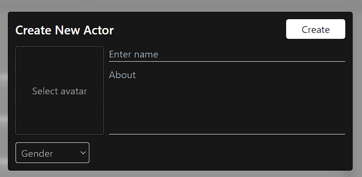

# ActorForm

<figure><figcaption></figcaption></figure>

```javascript
import React, { useEffect, useState } from "react";
import { ImSpinner3 } from "react-icons/im";
import { useNotification } from "../../hooks";
import { commonInputClasses } from "../../utils/theme";
import PosterSelector from "../PosterSelector";
import Selector from "../Selector";

const defaultActorInfo = {
  name: "",
  about: "",
  avatar: null,
  gender: "",
};

const genderOptions = [
  { title: "Male", value: "male" },
  { title: "Female", value: "female" },
  { title: "Other", value: "other" },
];

const validateActor = ({ avatar, name, about, gender }) => {
  if (!name.trim()) return { error: "Actor name is missing!" };
  if (!about.trim()) return { error: "About section is empty!" };
  if (!gender.trim()) return { error: "Actor gender is missing!" };
  if (avatar && !avatar.type?.startsWith("image"))
    return { error: "Invalid image / avatar file!" };

  return { error: null };
};

export default function ActorForm({
  title,
  initialState,
  btnTitle,
  busy,
  onSubmit,
}) {
  const [actorInfo, setActorInfo] = useState({ ...defaultActorInfo });
  const [selectedAvatarForUI, setSelectedAvatarForUI] = useState("");
  const { updateNotification } = useNotification();

  const updatePosterForUI = (file) => {
    const url = URL.createObjectURL(file);
    setSelectedAvatarForUI(url);
  };

  const handleChange = ({ target }) => {
    const { value, files, name } = target;
    if (name === "avatar") {
      const file = files[0];
      updatePosterForUI(file);
      return setActorInfo({ ...actorInfo, avatar: file });
    }

    setActorInfo({ ...actorInfo, [name]: value });
  };

  const handleSubmit = (e) => {
    e.preventDefault();
    const { error } = validateActor(actorInfo);
    if (error) return updateNotification("error", error);

    // submit form
    const formData = new FormData();
    for (let key in actorInfo) {
      if (key) formData.append(key, actorInfo[key]);
    }
    onSubmit(formData);
  };

  useEffect(() => {
    if (initialState) {
      setActorInfo({ ...initialState, avatar: null });
      setSelectedAvatarForUI(initialState.avatar);
    }
  }, [initialState]);
console.log(actorInfo)
  const { name, about, gender } = actorInfo;
  return (
    <form
      className="dark:bg-primary bg-white p-3 w-[35rem] rounded"
      onSubmit={handleSubmit}
    >
      <div className="flex justify-between items-center mb-3">
        <h1 className="font-semibold text-xl dark:text-white text-primary">
          {title}
        </h1>
        <button
          className="h-8 w-24 bg-primary text-white dark:bg-white dark:text-primary hover:opacity-80 transition rounded flex items-center justify-center"
          type="submit"
        >
          {busy ? <ImSpinner3 className="animate-spin" /> : btnTitle}
        </button>
      </div>

      <div className="flex space-x-2">
        <PosterSelector
          selectedPoster={selectedAvatarForUI}
          className="w-36 h-36 aspect-square object-cover"
          name="avatar"
          onChange={handleChange}
          lable="Select avatar"
          accept="image/jpg, image/jpeg, image/png"
        />
        <div className="flex-grow flex flex-col space-y-2">
          <input
            placeholder="Enter name"
            type="text"
            className={commonInputClasses + " border-b-2"}
            name="name"
            value={name}
            onChange={handleChange}
          />
          <textarea
            name="about"
            value={about}
            onChange={handleChange}
            placeholder="About"
            className={commonInputClasses + " border-b-2 resize-none h-full"}
          ></textarea>
        </div>
      </div>

      <div className="mt-3">
        <Selector
          options={genderOptions}
          label="Gender"
          value={gender}
          onChange={handleChange}
          name="gender"
        />
      </div>
    </form>
  );
}

```

```
const updatePosterForUI = (file) => {
    const url = URL.createObjectURL(file);
    setSelectedAvatarForUI(url);
  };
```

`createObjectURL(file)` is a method in JavaScript that is part of the `URL` interface. This method is used to create a special URL (Uniform Resource Locator) representing the given `File` or object. This URL can be used to reference the content of the file or blob directly.

It's commonly used in web applications to dynamically generate URLs for image files selected by the user, allowing you to display a preview of the image.

// Assuming 'fileInput' is an input element of type 'file'&#x20;

const file = fileInput.files\[0]; \
const url = URL.createObjectURL(file);

**Important Note:** It's crucial to call `URL.revokeObjectURL(url)` when you're done using the URL. This releases the resources associated with the URL and is necessary to avoid memory leaks.

```
  <PosterSelector
          selectedPoster={selectedAvatarForUI}
          className="w-36 h-36 aspect-square object-cover"
          name="avatar"
          onChange={handleChange}
          lable="Select avatar"
          accept="image/jpg, image/jpeg, image/png"
        />
```

<mark style="color:purple;">**Know About Deep Down How poster is handle**</mark>



[poster.md](../developer/reusable-code/poster.md)


```
 const formData = new FormData();
    for (let key in actorInfo) {
      if (key) formData.append(key, actorInfo[key]);
    }
    onSubmit(formData);
  };
```

**`const formData = new FormData();`**: This line creates a new instance of the `FormData` object. `FormData` is a built-in JavaScript object that provides a way to easily construct a set of key/value pairs representing form fields and their values.\
**`if (key) formData.append(key, actorInfo[key]);`**: Inside the loop, this line checks if the current `key` is truthy (i.e., not undefined, null, or an empty string). If it is, it appends a new key/value pair to the `formData` object. The key is the property name (`key`), and the value is the corresponding value from the `actorInfo` object (`actorInfo[key]`).
