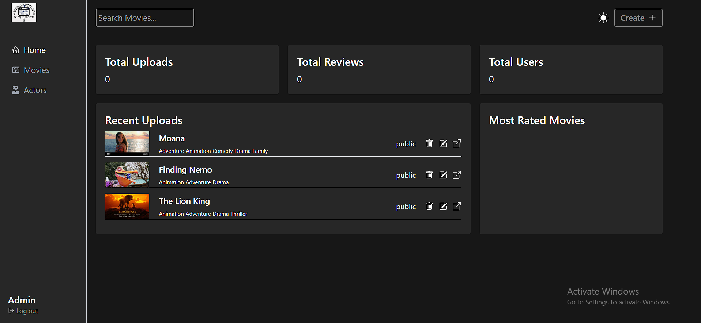

# Admin

<figure><figcaption><p>Admin view</p></figcaption></figure>

```jsx
<nav className="w-48 min-h-screen bg-secondary border-r border-gray-300">
      <div className="flex flex-col justify-between pl-5 h-screen sticky top-0">
        <ul>
          <li className="mb-8">
            <Link to="/">
              
            </Link>
          </li>
          <li>
            <NavItem to="/">
              <AiOutlineHome />
              <span>Home</span>
            </NavItem>
          </li>
          <li>
            <NavItem to="/movies">
              <BiMoviePlay />
              <span>Movies</span>
            </NavItem>
          </li>
          <li>
            <NavItem to="/actors">
              <FaUserNinja />
              <span>Actors</span>
            </NavItem>
          </li>
        </ul>
        <div className="flex flex-col items-start pb-5">
          <span className="font-semibold text-white text-xl">Admin</span>
          <button
            onClick={handleLogout}
            className="flex items-center text-dark-subtle text-sm hover:text-white transition space-x-1"
          >
            <FiLogOut />
            <span>Log out</span>
          </button>
        </div>
      </div>
    </nav>
    
const NavItem = ({ children, to }) => {
  const commonClasses =
    " flex items-center text-lg space-x-2 p-2 hover:opacity-80";
  return (
    <NavLink
      className={({ isActive }) =>
        (isActive ? "text-white" : "text-gray-400") + commonClasses
      }
      to={to}
    >
      {children}
    </NavLink>
  );
};

```

what is diff bet min-h-screen and h-screen ?



[tailwindcss-explaination.md](../tailwindcss-explaination.md)


```css
border-r border-gray-900
```

`border-r` is not a standalone class but is typically used in conjunction with other border utility classes, such as `border-gray-900`, to style the right border of an element.&#x20;


```
flex flex-col items-start
```

1. **`flex`**: This class is used to apply flexbox layout to an element, making it a flex container. This means that its children elements will become flex items and can be aligned and arranged using flexbox properties.
2. **`flex-col`**: This class is used to set the flex direction of the flex container to column. This means that the flex items will be arranged vertically, stacking on top of each other, instead of horizontally.
3. **`items-start`**: This class is used to align the flex items along the start of the cross-axis, which is the vertical axis when the flex direction is set to column. In this context, `items-start` will align the flex items to the top of the container.

