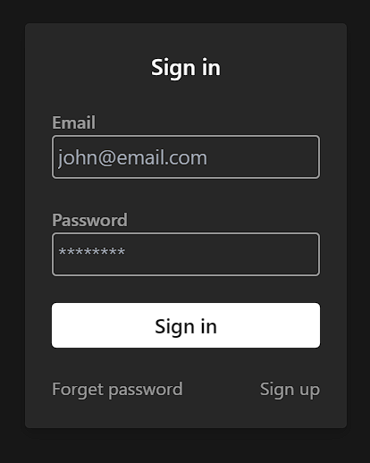

# SignUp

<figure><figcaption></figcaption></figure>

```jsx
<FormContainer>
      <Container>
        <form onSubmit={handleSubmit} className={commonModalClasses + " w-72"}>
          <Title>Sign in</Title>
          <FormInput
            value={userInfo.email}
            onChange={handleChange}
            label="Email"
            placeholder="john@email.com"
            name="email"
          />
          <FormInput
            value={userInfo.password}
            onChange={handleChange}
            label="Password"
            placeholder="********"
            name="password"
            type="password"
          />
          <Submit value="Sign in" busy={isPending} />

          <div className="flex justify-between">
            <CustomLink to="/auth/forget-password">Forget password</CustomLink>
            <CustomLink to="/auth/signup">Sign up</CustomLink>
          </div>
        </form>
      </Container>
    </FormContainer>

```

```jsx
import React from "react";
export default function FormContainer({ children }) {
  return (
    <div className="fixed inset-0 dark:bg-primary bg-white -z-10 flex justify-center items-center">
      {children}
    </div>
  );
}

```

**`fixed`**: This class makes the element position fixed, meaning it is positioned relative to the viewport, and will not move when the page is scrolled.

**`inset-0`**: This class sets the top, right, bottom, and left positions of the element to 0, effectively stretching the element to cover the entire viewport.

**`-z-10`**: This sets the z-index of the element to -10, meaning it will be positioned below elements with default or positive z-index values.

**`justify-center`**: This aligns the flex items along the main axis (horizontal axis) to the center.

**`items-center`**: This aligns the flex items along the cross axis (vertical axis) to the center<mark style="color:purple;">**.**</mark>

```javascript
import React from "react";

export default function Container({ children, className }) {
  return (
    <div className={"max-w-screen-xl mx-auto " + className}>{children}</div>
  );
}
```

<mark style="color:purple;">**`max-w-screen-xl`**</mark><mark style="color:purple;">** **</mark><mark style="color:purple;">**and**</mark><mark style="color:purple;">** **</mark><mark style="color:purple;">**`mx-auto`**</mark>

Tailwind CSS are commonly used together to create centered content within a container that has a maximum width on extra-large screens.

**`max-w-screen-xl`**: This class sets the maximum width of the element to a predefined value that corresponds to extra-large screen sizes. It ensures that the content doesn't become too wide on large screens, maintaining readability and a consistent layout.

**`mx-auto`**: This class applies automatic horizontal margin to the element, effectively centering it within its parent container. The `mx` stands for margin on the x-axis (left and right), and `auto` instructs the browser to distribute the available space evenly, pushing the element towards the center.

the content within the `div` element will be centered horizontally within the container, and the container itself will have a maximum width on extra-large screens, ensuring that the content doesn't extend too wide. This is a common pattern used in responsive web design to create visually appealing layouts that adapt well to different screen sizes.

```jsx
export default function Title({ children }) {
  return (
    <h1 className="text-xl dark:text-white text-secondary font-semibold text-center">
      {children}
    </h1>
  );
}
```

<pre class="language-javascript"><code class="lang-javascript">import React from "react";
export default function FormInput({ name, label, placeholder, ...rest }) {
  return (
    &#x3C;div className="flex <a data-footnote-ref href="#user-content-fn-1">flex-col-reverse</a>">
      &#x3C;input
        id={name}
        name={name}
        type="text"
        className="bg-transparent rounded border-2 dark:border-dark-subtle border-light-subtle dark:focus:border-white focus:border-primary w-full text-lg outline-none p-1 dark:text-white peer transition"
        placeholder={placeholder}
        {...rest}
      />
      &#x3C;label
        className="font-semibold dark:text-dark-subtle text-light-subtle dark:peer-focus:text-white peer-focus:text-primary transition self-start"
        htmlFor={name}
      >
        {label}
      &#x3C;/label>
    &#x3C;/div>
  );
}

</code></pre>

```
flex-col-reverse
```

This class sets the flex-direction property of the flex container to `column-reverse`. This means that the child elements will be stacked vertically in reverse order, with the last item appearing at the top and the first item at the bottom.

`flex-col-reverse` is used here to control the visual presentation of the input field and label, allowing the label to appear above the input field on the screen while maintaining the correct order in the HTML markup for accessibility.

```javascript
import React from "react";
import { Link } from "react-router-dom";

export default function CustomLink({ to, children }) {
  return (
    <Link
      className="dark:text-dark-subtle text-light-subtle dark:hover:text-white hover:text-primary transition"
      to={to}
    >
      {children}
    </Link>
  );
}
```

basic stucture of Login /signUp page&#x20;

```jsx
import React, { useEffect, useState } from 'react'
import ReactDOM from 'react-dom/client';

const Script = () => {
  const [userInfo, setUserInfo] = useState({
    name: "",
    email: "",
    password:"",
  })
  const handleClick = async () => {
    window.alert(`welcome ${userInfo.name}`)
  }
  const handleChange = ({ target }) => { 
     const { value, name } = target;
    setUserInfo({ ...userInfo, [name]: value });
  };
  const handleSumbit = (e) => { 
    e.preventDefault()
    console.log(userInfo)

  } 
  
  return (
    <div className='bg-slate-200 inset-0 fixed  -z-10 flex justify-center items-center'>
      <form className='w-72 bg-white drop-shadow-lg rounded p-4 space-y-4'onSubmit={handleSumbit}>
        
        <PageInput
          lable={"Name"}
          type={"text"}
          name={"name"}
          placeholder={"Name"}
          onChange={ handleChange}
        />
           <PageInput
          lable={"Email"}
          type={"text"}
          name={"email"}
          placeholder={"suajrkhonde@gmail.com"}
          onChange={ handleChange}
        />
           <PageInput
          lable={"Password"}
          type={"password"}
          name={"password"}
          placeholder={"***********"}
          onChange={ handleChange}
        />
        <Sumbits
          onClick={handleClick}
          value={"Sumbit" }
        />
      </form>
    
    </div>
  )
}

const PageInput = ({type,placeholder,name,value,lable,...rest}) => { 
  return (
    <div className='flex flex-col'>
      <label className='font-semibold '>{lable}</label>
      <input className="bg-transparent rounded border-2 p-2"
        name={name}
        type={type}
        placeholder={placeholder}
        value={value}
        {...rest}
      />
    </div>
    
  )
}
const Sumbits = ({ onClick, type, value }) => {
  return(
    <button
      type={type || "submit"}
      className="w-full rounded bg-transparent  text-black hover:bg-opacity-90 transition font-semibold text-lg cursor-pointer h-10 flex items-center justify-center  border-2"
      onClick={onClick}
   >  { value}</button>)

}

const rootelement=document.getElementById("root")
const root = ReactDOM.createRoot(rootelement);
root.render(<Script />);
export default Script;

```

<figure><figcaption><p> </p></figcaption></figure>

[^1]: Please see below&#x20;
